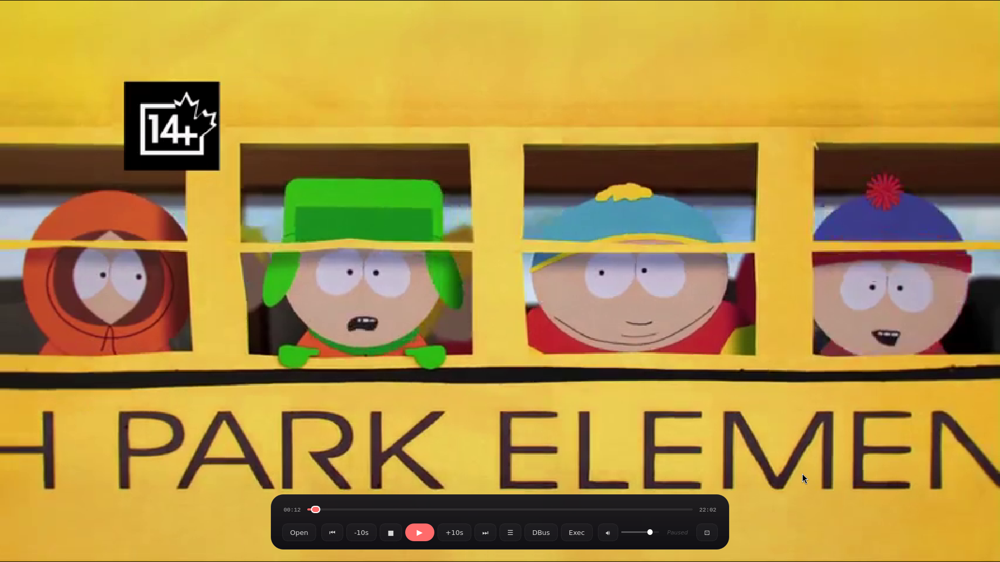
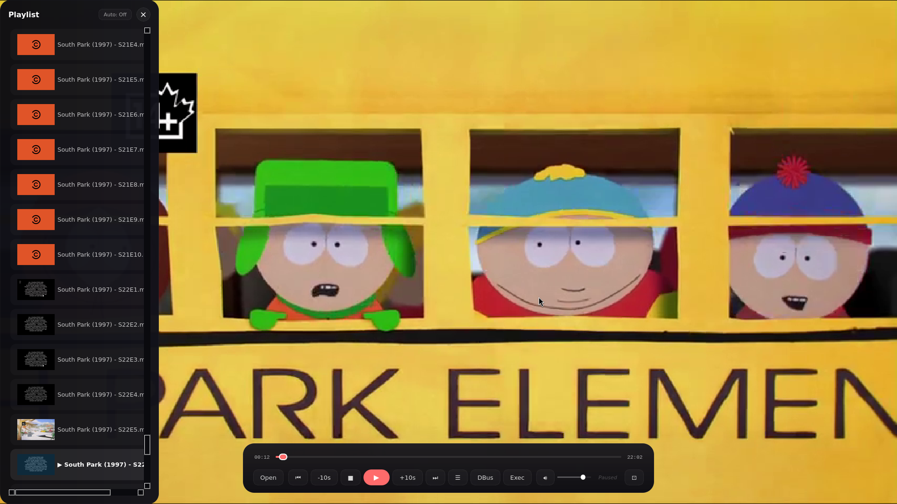
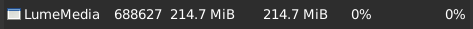
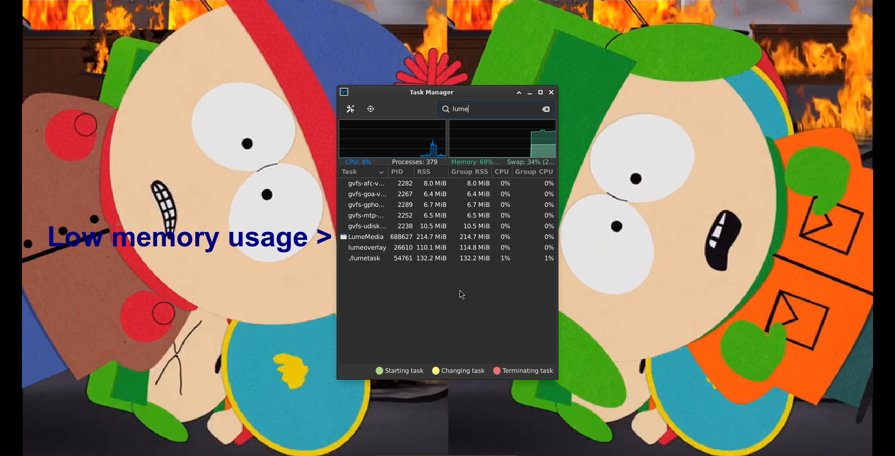

# Lume Media Player

  

  <b>Lume Media Player</b> is a Qt Widgets media player for the Lume environment.

  
  

  
  

## Overview

Lume Media Player is built with Qt Widgets and designed with memory safety in mind. It stays around **100 MB when idle** and about **230 MB at maximum**, which is strong efficiency for a media player with a full graphical interface and useful features.

It is a **Lume app** and it reads theme values from:

    ~/.lumeconf/theme.json

## Features

- Qt Widgets interface
- Keyboard shortcuts
- Playlist support
- File and argument-based media opening
- Theme support from `~/.lumeconf/theme.json`
- Memory-conscious design
- Built for the Lume desktop environment

## Build

    qmake && make -j$(nproc)

## Usage

Open a media file directly:

    media /path/to/video.mp4

Open a folder:

    media /path/to/media-folder

## Theme File

Lume Media Player looks for:

    ~/.lumeconf/theme.json

Theme example:

    {
        "bg-primary":     "#1a0a0a #130942 45deg",
        "bg-secondary":   "#120505",
        "bg-tertiary":    "#1f0a0a",
        "bg-hover":       "#2a0f0f",
        "text-primary":   "#ffe4e4",
        "text-secondary": "#d4a5a5",
        "text-muted":     "#704040",
        "accent-purple":  "#ff6b6b",
        "accent-blue":    "#ff4757",
        "accent-cyan":    "#ff6348",
        "accent-green":   "#ff5252",
        "accent-red":     "#ff3838",
        "accent-yellow":  "#ff9f43",
        "border-color":   "#2a0f0f",
        "selection-bg":   "rgba(255, 56, 56, 0.15)",

        "border":               "on",
        "outline-glow":         "on",
        "border-pulse-effect":  "on",
        "rounding-corners":     "on",
        "border-thickness":     "2",
        "border-opacity":       "100",
        "background-opacity":   "10",

        "general-opacity":      "100",
        "onwindow-opacity":     "100",
        "outwindow-opacity":    "85",
        "title-opacity":        "100",
        "notification-opacity": "10",
        "toolbar-opacity":      "100",
        "text-follows-opacity": "on",

        "windows-blur":         "on",
        "blur-intensity":       "40",

        "onwindow-outline":     "on",
        "offwindow-outline":    "off",
        "fullscreen-corners":   "0",
        "minimized-corners":    "8",
        "taskbar-border":       "on",
        "quicksettings":        "right",
        "notification-position": "bottom,right",
        "toast-position":       "bottom,center",
        "taskbar-center":       "bottom",
        "taskbar-layer":        "fixed",
        "clock-font":           "DejaVu Sans Mono",
        "notification-sound":   "path/to/sound",

        "taskbar-position":     "bottom"
    }

## Create `theme.json` if missing

    #!/usr/bin/env bash
    set -e

    THEME_DIR="$HOME/.lumeconf"
    THEME_FILE="$THEME_DIR/theme.json"

    mkdir -p "$THEME_DIR"

    if [ ! -f "$THEME_FILE" ]; then
        cat > "$THEME_FILE" <<'EOF'
    {
        "bg-primary":     "#1a0a0a #130942 45deg",
        "bg-secondary":   "#120505",
        "bg-tertiary":    "#1f0a0a",
        "bg-hover":       "#2a0f0f",
        "text-primary":   "#ffe4e4",
        "text-secondary": "#d4a5a5",
        "text-muted":     "#704040",
        "accent-purple":  "#ff6b6b",
        "accent-blue":    "#ff4757",
        "accent-cyan":    "#ff6348",
        "accent-green":   "#ff5252",
        "accent-red":     "#ff3838",
        "accent-yellow":  "#ff9f43",
        "border-color":   "#2a0f0f",
        "selection-bg":   "rgba(255, 56, 56, 0.15)",

        "border":               "on",
        "outline-glow":         "on",
        "border-pulse-effect":  "on",
        "rounding-corners":     "on",
        "border-thickness":     "2",
        "border-opacity":       "100",
        "background-opacity":   "10",

        "general-opacity":      "100",
        "onwindow-opacity":     "100",
        "outwindow-opacity":    "85",
        "title-opacity":        "100",
        "notification-opacity": "10",
        "toolbar-opacity":      "100",
        "text-follows-opacity": "on",

        "windows-blur":         "on",
        "blur-intensity":       "40",

        "onwindow-outline":     "on",
        "offwindow-outline":    "off",
        "fullscreen-corners":   "0",
        "minimized-corners":    "8",
        "taskbar-border":       "on",
        "quicksettings":        "right",
        "notification-position": "bottom,right",
        "toast-position":       "bottom,center",
        "taskbar-center":       "bottom",
        "taskbar-layer":        "fixed",
        "clock-font":           "DejaVu Sans Mono",
        "notification-sound":   "path/to/sound",

        "taskbar-position":     "bottom"
    }
    EOF
    fi

## Keyboard Shortcuts

The player includes useful shortcuts for playback and navigation.

## License

Lume Media Player is part of the Lume app ecosystem.
